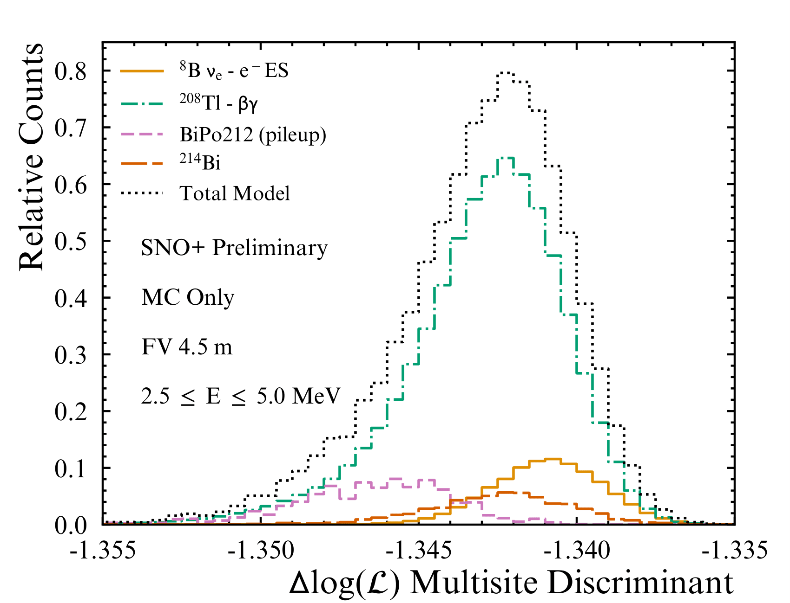

# Multisite Event Discrimination for 8B Solar Neutrinos in Large Liquid Scintillator Detectors

This repository contains the analysis scripts for the first application of 'multisite' event disrimination for solar neutrino signal extraction in a large liquid scintillator detector, as demonstrated in my thesis with SNO+ detector full-fill data.

First, a brief account of multisite event discrimination and the log-likelihood signal extraction method is given. For complete details, see thesis chapter 4.

Second, a step by step walkthrough of the analysis is given, with key scripts highlighted. This will mostly be of interest to future SNO+ researchers seeking to repeat/verify/improve this analysis.

## Theory
This analysis is an extended-binned maximum log-likelihood fit for the number of 8B solar neutrino elastic scattering interactions. The log-likelihood is:

$$log(\mathcal{L}) = \sum_k log\left(\sum_i N_i P_{ik}\right) - \sum_i N_i$$

Where $n_k$ is the number of events in bin $k$ of the dataset, $N_i$ is the normalisation of event type $i$, and $P_{ik}$ is the counts in bin $k$ for event type $i$ in the normalised feature PDF. This analysis uses two features of the data: energy and a multisite discriminant. As shown elsewhere, the energy and multisite discriminant feature are independent, and their respective contributions to the overall log-likelihood are calculated independantly using the above and summed. 

The respective normalisations of the signal (8B solar neutrino elastic scattering interactions) and background noise (dominated by 208Tl $\beta$ / $\gamma$ decays) are extracted from a dataset of 145.7 days of full-fill scintillator data. An energy domain of 2.5 to 5.0 MeV was chosen due to the sensitivity of solar neutrino flux measurements in this region to beyond standard model physics.

The impact of including the additional multisite feature in the signal extraction is quantified by comparing the profile-loglikelihood frequentist confidence intervals obtained when only using energy information.    

### Energy Feature
The energy of interactions in the SNO+ detector are reconstructed using MC models relating the number of photomultiplier tube (PMT) hits to true simulated energy. These models were calibrated by comparing the simulated number of PMT hits to data distributions, both obtained from internal 214Bi-214Po decays.

Indicative energy distributions for the events within the 2.5 to 5.0 MeV ROI are shown in the figure below, obtained from MC simulations. The shape information encoded in this feature is used in the signal extraction code, in conjunction with the multisite discriminant feature explained below. The respective normalisations were obtained from measured rates of 214Bi-214Po decays (see thesis).

### Multisite Discriminant Feature
Interactions in liquid scintillator may be classifed into two broad classes of events: those which produce point-like energy depositions, and those which deposit energy over a broad area at a series of discrete vertices. The former are electron-like events, such as those produced by 8B solar neutrino elastic scattering or radioactive $\beta$ decays. The latter class, multisite, frequently arise from radioactive decays involving $\gamma$ particles, such as internal 208Tl $\beta$ / $\gamma$ decays, and it is the Compton scattering of these $\gamma$ that produce multiple energy deposition verticies in the scintillator.

The multiple energy depositions lead to a broader observed distribution of PMT hit times compared to single-site events. The figure below shows this broadening, obtained from MC simulations of 8B $\nu_e$ elastic scattering and internal 208Tl $\beta$ / $\gamma$ decays.

Where 'time residual' is a first order position independent transformation of the raw PMT hit times obtained via: 

$$t_{res} = t_{hit} - t_{tof} - t_{ev}$$

Where $t_{res}$ is the time residual, $t_{hit}$ is the observed (raw) PMT hit time, $t_{tof}$ is the time of flight for a photon emitted from the reconstructed interaction vertex to the hit PMT. and $t_{ev}$ is the reconstructed interaction time relative to the detector's event trigger.

Essentially, using the time residual rather than raw PMT hit times removes the problem of interactions occuring closer to the PMTs having different residual shapes than those occuring at the center. Instead, the underlying physics of the interaction determines the observed time residual distribution shape.

As shown in the figure above, the different in the observed time residual distributions between the signal (orange) and background (green) is slight. However, since the MC is well-calibrated (see thesis chapter 3), and the PDFs are constructed with high statistics, these discrepencies are significant. A log-likelihood ratio discriminant is used to obtain the 'multisite-ness' of a given event via:

$$ log(\mathcal{L}) = \frac{1}{N}\sum_i^N log\left(\frac{P_S(t_{res}^i)}{P_B(t_{res}^i)}\right)$$
Where $N$ is the number of PMT hits in a given event and $P_{S,B}(t_{res}^i)$ is the counts in the normalised signal or background time residual PDF in the bin containing $t_{res}^i$.

Using separate populations of simulated events to those used in the time residual PDFs shown above, the multisite discriminant distributions are shown in the figure below.

As with the energy feature, indicative multisite feature distributions using simulated events in the 2.5 to 5.0 MeV domain are shown below.

This plot shows that different event types have different distributions in multisite feature space, giving a qualitive rationale behind incorporating multisite into the log-likelihood signal extraction framework.

## Results with Asimov Dataset
An Asimov dataset was constructed using the expected normalisations of each interaction type within the region of interest. These Asimov datasets are shown in the energy and multisite distribution figures above.

Performing fits on the Asimov datasets, the profile log-likelihood distributions are shown below. Three fits were performed: energy only (yellow), multisite only (green), and the combined fit (black).

As shown by the confidence intervals, incorporating the multisite discriminant feature into the likelihood leads to a noticeable improvement in the precision of the 8B solar neutrino normalisation measurement.

## Results with Real Data
Not allowed for external distribution (yet). 

## Key Scripts
Data processing and cleaning is done with C++ scripts due to the amount of data, and the fits are performed using analysis scripts written in Python.

What follows is a step-by-step explanation of how to run this analysis. We assume access to an up to date version of the SNO+ Reactor Analysis Toolkit (`RAT`), a dataset of `RATDS` and `NTUPLE` SNO+ data files in respective directories, access to `Python 3.8` and `C++11` (or greater), and a `HTCondor` batch system.

### 1. Create Energy and Multisite PDFs
These PDFs are used in the signal extraction fits (see theory below). First, simulate Monte-Carlo (MC) for each interaction type of interest using `RAT`. Example macros may be found in `mc_studies/condor/bismsb_macros`, and a script to submit parallel jobs to HTCondor is `mc_studies/scripts/bismsb_mc_submission.py`. Real detector conditions are simulated, and as such a runlist in the form of a `.txt` file of SNO+ runs is required by the script.

Once the MC is generated the PDFs must be produced in a three-step process, due to the dependence of the multisite discriminant on the underlying time residual PDFs:

1. Split MC into two populations - one for time residual PDFs and another for multisite PDFs based on the time residuals. Do not double-dip! Separate runlists are recommended to keep the populations separate.
2. Create time residual and energy PDFs for signal and background from population 1
3. Use time residual PDFs to evaluate multisite discriminant PDF with population 2

`mc_studies/scripts/create_pdfs.cpp [isotope_name] [run_number] [fv_cut] [z_cut] [path_to_mc] [path_to_output_dir]` 

is used to create the energy and time residual PDFs. 

This assumes the MC for each isotope is saved as `${isotope_name}_${run_number}.root` in a single directory.

The output is a `.root` file per input file containing `TH1D` (1D histograms) of energy and time residual information, alongside event-level and hit-level `TTree` structures. The event-level TTree contains most reconstructed information about each event, including energy and position. A time residual and energy `TH1D` is created for each energy range (see start of `create_pdf()` function).

The `HTCondor` batch system may be used to create the energy and time residual PDFs more efficiently. Running `python3 mc_studies/scripts/condor_submission.py` with `create_pdfs()` function uncommented submits a job per MC output file in a given `.txt` runlist.

Each output `.ROOT` file may be combined into a single file using `hadd total.root ${isotope_name}*.root` within the output directory, being careful not to mix signal and background output files. 

Finally, the multisite discriminant PDFs are created using events in population 2, as defined in a respective runlist:

`mc_studies/scripts/evaluate_discriminants.cpp [isotope_name] [run_number] [fv_cut] [z_cut] [input_fpath] [output_fpath]`

This script loads the MC events from population 2, along with the time residual PDFs in the output file created from population 1. The multisite discriminant is calculated for each event in population 2 according to the log-likelihood ratio discriminant given in the theory section (`multisite_discriminant()` function within `evaluate_discriminants.cpp`).

The output `.ROOT` files contain a `TTree` for each energy range of interest. These `TTree` structures contain the multisite and energy information for each event in population 2, and may be combined into a single file with `hadd` as above. In the subsequent steps, these population 2 events were used for both the energy and multisite PDFs, with population 1 serving only to generate the underlying time residual distributions.

Again, `condor_submission.py` may be used to submit jobs to `condor`, with `submit_analysis()` function uncommented.

### 2. Measure BiPo Coincidence Decays in Dataset and Calculate Event Normalisations
Moving to real data, it is necessary to estimate the number of BiPo214 and BiPo212 decays occuring within the dataset. This allows a background model to be created when considering the Uranium-238 and Thorium-232 decay chains (see thesis, chapter 3). This step is about characterising the expected noise within the dataset.

`data_studies/scripts/bipo_tagger_systematic.cpp` may be used to tag the BiPo coincidences within a given data run. Subruns are combined using `TChain`. An automated direct acyclic graph (DAG) is used to perform the BiPo tagging across the dataset: `data_studies/scripts/dag_submission.py` contains the function `submit_bipo_tagging()`: given a runlist, number of jobs per layer in the DAG (default 50), and output directory name, the dataset noise is calculated. `hadd`ing the output `.ntuple` files allows the total number of BiPo coincidences in the dataset to be obtained.

See thesis chapter 4 (background model) for calculation details of the other event normalisations in the 2.5 to 5.0 MeV region of interest (ROI).

**NOTE: both BiPo214 and BiPo212 must be tagged in this way independently: coincidence cuts are hard-coded in `bipo_tagger_systematic.cpp` and must be changed for 214 / 212 respectively.**

### 3. Create Background Model Plots
A comparison of the background model and observed data normalisations may be created using `data_studies/scripts/background_model/create_energy_spectrum_plot.py`. This assumes `.npy` arrays of energy or nhits are available for each event type considered. `data_studies/scripts/background_model/extract_mc_information.py` creates these arrays for a given event type simulated.

Each event-type PDF is scaled to the expected rates provided in `/data_studies/scripts/background_model/expected_rates_database.json` and obtained from the clean selection BiPo tagging (and subsequent calculations) performed in step 2.

### 4. Extract Energy and Multisite Features from Dataset
This gets a little convoluted and should be refactored in the future.

In order to extract a clean sample of 8B signal and 208Tl background events, coincident backgrounds are removed with a set of generalised cuts (see thesis chapter 4). In addition, to remove spurious noise (e.g. neck hotspot followers - again, see thesis), retriggers are removed. The full set of data cleanliness cuts are summarised in thesis, chapter 4.

In addition, we have both `.NTUPLE` and `.RATDS` data file types. The `.RATDS` file type contains hit-level information, whereas the `.NTUPLE` does not. Thus, the multisite discriminant may only be calculated using the `.RATDS` files. However, due to the size of the dataset and the additional memory required to store hit-level information, it is not possible to perform the analysis directly on `.RATDS` files. Instead, events falling outside the analysis ROI, failing data cleaning and/or reconstruction checks, flagged as retriggers or as coincident backgrounds, are tagged in the lighter `.NTUPLE` files for removal first.

This analysis proceeds as follows:

1. `data_studies/scripts/ultimate_dataset_looper.cpp` - loops through dataset `.NTUPLES` and identifies events possibly owing to coincident backgrounds. Global trigger IDs (GTIDS) and run numbers are saved, alongside histograms showing the usual coincident tagging plots. The energy spectrum of the dataset before and after coincidences are removed is outputted.

2. `data_studies/scripts/get_dataset_gtids.py` - function `get_dataset_gtids()` creates `.txt` files per run in dataset runlist of gtids **NOT** flagged as coincidences and reconstructing within the analysis ROI.

3. `data_studies/scripts/condor_submission.py` - function `submit_ratds_extraction()` creates a condor job per run in dataset which loops over `.RATDS` files and extracts events to hit-level output file with GTID matching respective run's GTID `.txt` list created in step 2. At this point, we have every event in the dataset ROI not tagged as a coincidence ready for multisite and energy feature extraction.

4. `data_studies/scripts/remove_retrigs_eval_discriminant.cpp` - script first loops over every run in dataset and saves the GTIDs of each event which occurs within 500 ns of a preceeding event. Next, the multisite event discriminant and energy features are extracted from the remaining events within the analysis ROI. A `.NTUPLE` output file is produced per run containing all event features, including energy, multisite, position, time, ITR etc.

As stated above, there is no reason why the retrigger and general coincidence tagging cannot occur within the same script.

### 5. Perform Signal Extraction (extended binned maximum log-likelihood normalisation fit)
A python script using a simple grid search over the 8B and 208Tl normalisation is performed by `mc_studies/scripts/simple_profile_likelihood.py`. 

Three fits are performed: energy only, multisite only, and a combined fit using both energy and multisite features. Fitting occurs in `profile_likelihood_scan()`, which evaluates the likelihood for a range of signal normalisations. This function calls `evaluate_loglikelihood()` for single feature fits and `evaluate_combined_loglikelihood()` for combined feature fits.

Output plots are generated showing: a) the profile loglikelihood curves for each fitting method; b) the data vs model fit results; c) a quite useless 2D heatmap of the loglikelihood space as a function of signal and background normalisation. 

The following variables customise the script's operation:

1. Either an Asimov or real dataset may be used by changing the `analyse_real_dataset` boolean
2. Regenerate multisite and energy PDF construction with `generate_datasets` boolean. If `TRUE`, PDFs are loaded in run by run from the output files created in step 4, and are saved as a `.npy` array. If `FALSE`, the PDFs are loaded directly from the `.npy` array. **Note: when changing energy ROI you will need to set this to TRUE the first time you perform fits.**
3. Change the energy ROI with `energy_string`.
4. Change fiducial volume (FV) with `FV_CUT`: **Note: you should have created PDFs with the same FV you are using data for.**

**Note: the bin edges in multisite feature space change depending on the normalisation used in the feature extraction steps. You may have to fiddle with the bin bounds to get it to work if the normalisation on the PDFs changes.**

**Note: the signal and background hypothesis are defined as integer `np.linspace()` or `np.arange()` arrays, the bounds of which need be updated if using a more restrictive energy ROI or FV.**